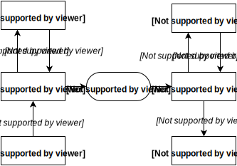

class: center, middle

# Automation of creating templates of a web application

author: __Milan Darjanin__

supervisor: __RNDr. Tomáš Kulich, PhD.__

---

# Aim of thesis

- Implement a tool for creating template of a web application from predefined components.
- Design easy to learn input language that will be used by developer.
- Create a modular package system with possibility to add new packages of components.
- Define post-processing mechanism, that will transform output to the required template language.

---

# Work this term

- February
  + basics of the Ruby language
      * [codecademy.com](http://www.codecademy.com)
- March
  + advance ruby tricks and techniques
      * Olsen, R., 2011. _Eloquent Ruby_. Addison-Wesley Professional.
- April
  + YAML
      * Ben-Kiki, Oren, Clark Evans, and Brian Ingerson. _YAML Ain't Markup Language (YAML™) Version 1.1._ yaml.org, Tech. Rep (2005).
  + Bootstrap, erb, [haml.info](http://haml.info)
- May
  + creating gems in Ruby
      * [guides.rubygems.org/make-your-own-gem/](http://guides.rubygems.org/make-your-own-gem/) 
  + presentation for Project Seminar 1
  
---

# Ruby

- object oriented language
- dynamic typing
- EVERYTHING is an _object_
- garbage collection
- operator overloading
- support for Unicode
- RubyGems - package management
- supports all major platforms
- ...

---

# Ruby - _class_

```ruby
class Item
  attr_accessor :name, :count
  attr_reader :price

  def initialize(name, price, count)
    @name = name
    @price = price
    @count = count
  end

  def available?
    @count > 0 ? true : false
  end

  def price_drop(percent)
    Item.new @name, @price * percent / 100, @count
  end

  def price_drop!(percent)
    @price *= percent / 100
    self
  end
end
```

---

# Ruby - _monkey patching_

#### Change any class

```ruby
class String
  def caesar
    self.chars.map { |c| ((c.ord - 'a'.ord + 3) % 26 + 'a'.ord).chr }.join
  end  
end 
```

```ruby
'abcxyz'.caesar
# => "defabc"
```

---

# Ruby - _metaprogramming_

```ruby
class A
  def method_missing(method, *args, &block)
    "method_missing #{method} with arguments: #{args.join(', ')}"
  end
end

obj = A.new

obj.random_method(1, 'abc', true)
# => "method_missing captured a call to random_method with arguments: 1, abc, true"
```

```ruby
class A
  METHOD_NAMES = ['abc', 'def', 'ghi', 'jkl', 'mno']

  METHOD_NAMES.each do |name|
    define_method(name) do |arg|
      "Called method #{name} with argument: #{arg}"
    end
  end
end

obj = A.new
obj.abc(42)        # => "Called method abc with argument: 42"
obj.mno('arg')     # => "Called method mno with argument: arg"
```

---

# RubyGems

- package management
- easy installation & adding distribution

```shell
├── Rakefile
├── bin
│   └── hola
├── hola-0.0.0.gem
├── hola-0.0.1.gem
├── hola-0.0.2.gem
├── hola.gemspec
├── lib
│   ├── hola
│   │   └── translator.rb
│   └── hola.rb
└── test
    └── test_hola.rb
```

---
class: image-slide

# Application



---

# CLI

- input & output from application will be using CLI
- written using `thor`
- [whatisthor.com](http://whatisthor.com)

```shell
app --theme bootstrap --output haml

app --theme bootstrap --output haml --file out.haml
```

- later will be added package manager for themes & output rules

```shell
app theme new theme-name

app theme publish
```

---

# Parser

- convert input to vDOM using package specified on the input
- if specified variables in input syntax set right values

```yaml
form:
    input:    { title: 'Name' }
    email:    { title: 'Email' }
    password: { title: 'Password' }
    button:   { title: 'Log in' }
```

#### Problems

- some tags have children like `form` tag
- different tags can not have children like `input`
- default values for attributes `title`, `name`, etc.

---

# vDOM & Output rules

- parsed input with applied theme will be converted to object representation
- applying output rules to this objects
- try to implement own version
- inspiration from [github.com/plexus/hexp](https://github.com/plexus/hexp)


- output rules will define output syntax
- goal of thesis is to write few to show they usage
- build package manager for them to easier sharing

---

# Similar project

- [emmet.io](http://emmet.io)
- plugin for text editor that speeds up writing HTML & CSS

```html
nav>ul>(li.nav-item>a{item $1})*3
```

```html
<nav>
    <ul>
        <li class="nav-item"><a href="">item </a></li>
        <li class="nav-item"><a href="">item </a></li>
        <li class="nav-item"><a href="">item </a></li>
    </ul>
</nav>
```

- syntaxProfiles.json [docs.emmet.io/customization/syntax-profiles/](http://docs.emmet.io/customization/syntax-profiles/)

#### Differences
- emmet is to make writing html faster, but you still need to know CSS styles
- syntaxProfiles.json is to make small changes like choose between XHTML or HTML
