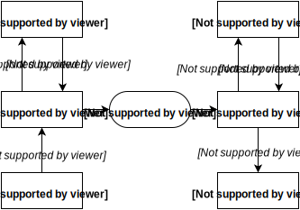

class: center, middle

# Automation of creating templates of a web application

author: __Milan Darjanin__

supervisor: __RNDr. Tomáš Kulich, PhD.__

---

# Aim of thesis

- Implement a tool for creating template of a web application from predefined components.
- Design easy to learn input language that will be used by developer.
- Create a modular package system with possibility to add new packages of components.
- Define post-processing mechanism, that will transform output to the required template language.

---
class: image-slide

# Diagram



---

# CLI

- input & output from application will be using CLI
- written using `thor`
- [whatisthor.com](http://whatisthor.com)

```shell
app --theme bootstrap --output haml

app --theme bootstrap --output haml --file out.haml
```

- later will be added package manager for themes & output rules

```shell
app theme new theme-name

app theme publish
```

---

# Similar project

- [emmet.io](http://emmet.io)
- plugin for text editor that speeds up writing HTML & CSS

```html
nav>ul>(li.nav-item>a{item $1})*3
```

```html
<nav>
    <ul>
        <li class="nav-item"><a href="">item </a></li>
        <li class="nav-item"><a href="">item </a></li>
        <li class="nav-item"><a href="">item </a></li>
    </ul>
</nav>
```

- syntaxProfiles.json [docs.emmet.io/customization/syntax-profiles/](http://docs.emmet.io/customization/syntax-profiles/)

#### Differences
- emmet is to make writing html faster, but you still need to know CSS styles
- syntaxProfiles.json is to make small changes like choose between XHTML or HTML
